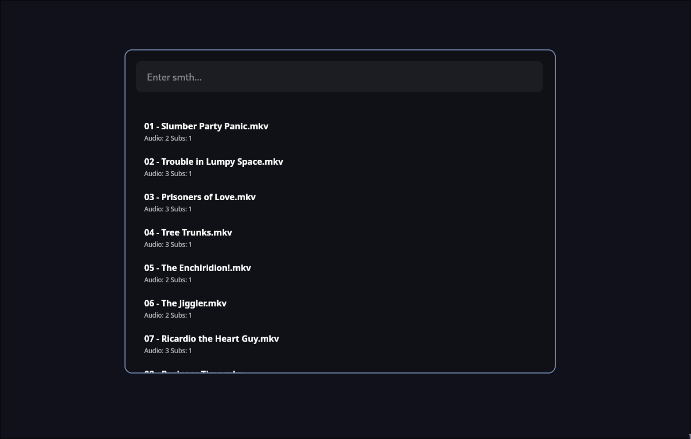

# Zord ⚡️
Zord is an application designed for comfortably browsing and selecting videos on your Linux system.

## Installation
I'm kinda lazy, so there are no packages available on AUR *yet*.  
To install Zord manually, follow these steps:
```bash
git clone REPO_HERE
cd zord 
make build 
make install 
```

## Usage
Before using Zord, you need to create a configuration file located at `~/.config/zord/config.toml`.  
Here’s an example configuration:
```toml
[volumes]
dirs = []

[options]
command = "/usr/bin/mpv"
```
- In the `volumes.dirs` array, specify the directories where your videos are stored.  
- The `options.command` field should point to your preferred video player (e.g., `mpv`).

## Screenshots


## License
This project is licensed under the MIT License.

## Contributing
Contributions are welcome! Feel free to submit pull requests or report issues.  
